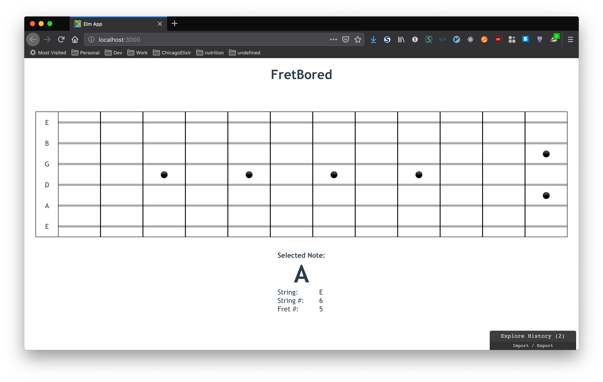

# FretBored

[](https://travis-ci.org/dkarter/fretbored-elm)

A guitar fretboard memorization game built in Elm




[Check it out here](http://fretmaster.doriankarter.com/)

## Dependencies

This app uses Yarn. Ensure you have it installed.

Install `create-elm-app` globally using yarn:

```sh
yarn global add create-elm-app
```

Then in the source directory run `yarn install`.


## Running

In two separate terminals run:

```sh
yarn watch-css
```

```sh
elm-app start
```

## Testing

Run `elm-app test`
